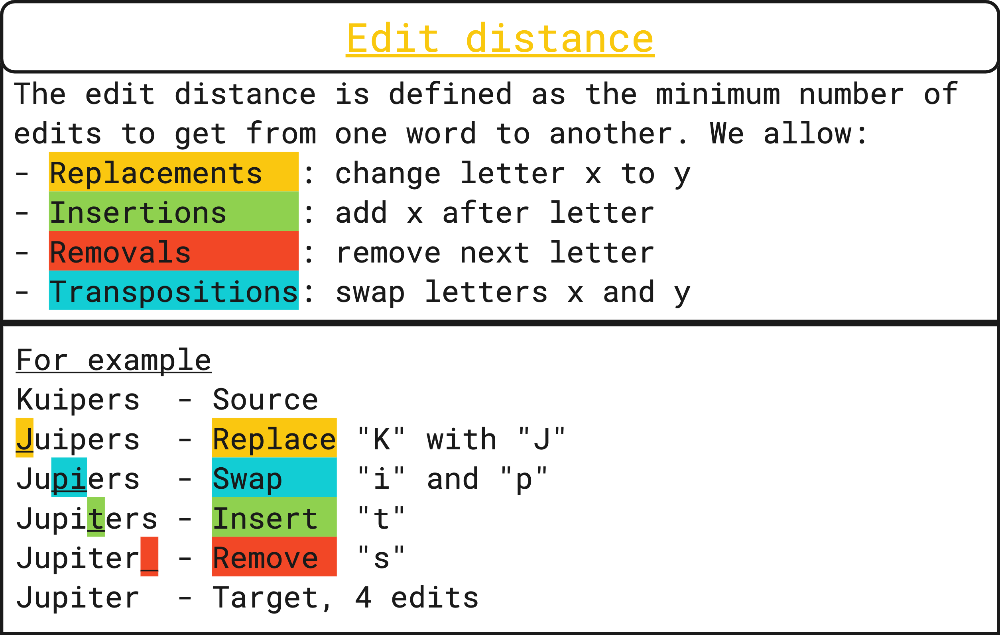
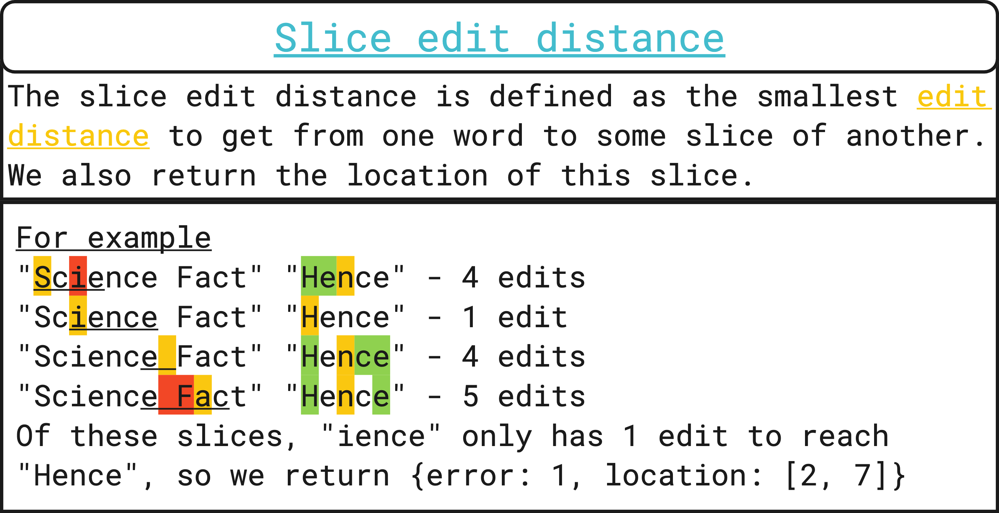
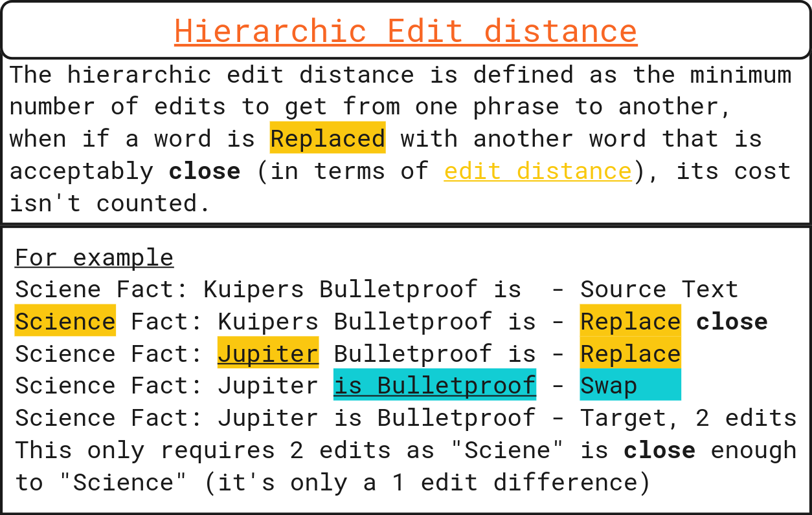

# Report Corrections

This folder contains methods used to correct column values for each report. These corrections are then applied to each report as it is fetched or can be manually applied to the pre-existing raw reports.

There's also tooling to add manual corrections for edge cases that can't be automatically corrected and quite a lot of approximate string matching algorithms to facilitate corrections.

The purpose of each file is given below:

## [`approx_match.js`](./approx_match.js)

This file gives some common algorithms for appoximate string matching and some custom ones that I came up with for specific situations.

### [`edit_distance`](./approx_match.js#L121)

When defining our [edit distance](https://en.wikipedia.org/wiki/Edit_distance) we include transpositions (A [Damerau–Levenshtein](https://en.wikipedia.org/wiki/Damerau%E2%80%93Levenshtein_distance) distance) and allow the costs of each edit to be configured, i.e. we can set the cost of additions to 1.5 instead of the default 1.

My implementation also returns the full edit distance array, for other algorithms to use.

### [`min_edit_slice`](./approx_match.js#L156)

Whilst cutting edge algorithms (using bitwise automatons) can acheive quadratic ($O(mn)$) complexities, I basically had no idea how they worked. So I just implemented a decently efficient ($O(m^2 n)$) implementation that reuses the full edit distance array for each slice start position.

My implementation also returns the slice with the minimum distance, the location of this slice, the distance and full edit distance array for this slice.

### [`hierachic_match`](./approx_match.js#L373)

When attempting matching to use string matching on sentences, it can be useful to first compare
words, _then_ compare individual letters. For this purpose, we can define a hierachical edit
distance as the edit distance in words between the two sentences, ignoring any replacements where
the edit distance between words is sufficiently small.

Our implementation also includes:

- the ability to ignore case
- the ability to ignore words from word distance
- configuration for the number of allowed word and letter errors
- whether to pick a slice match or a full match
